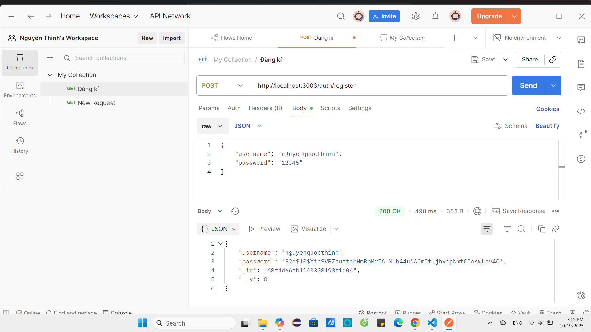
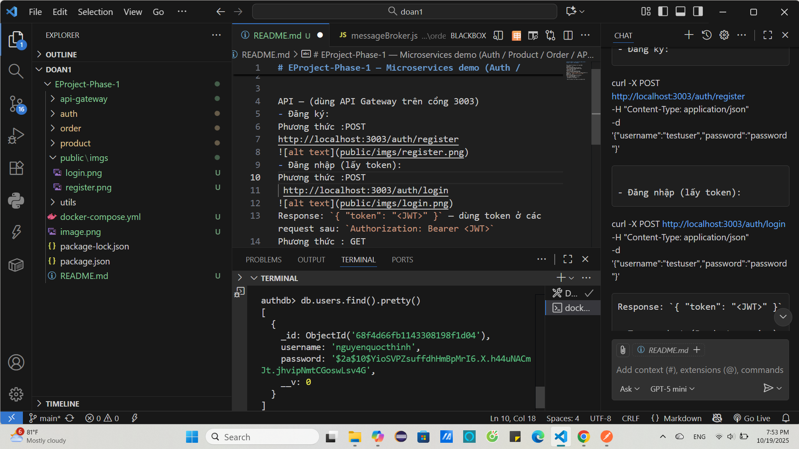
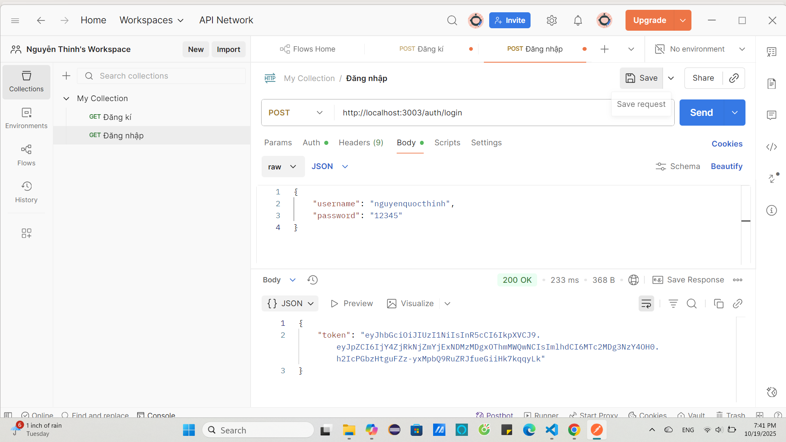
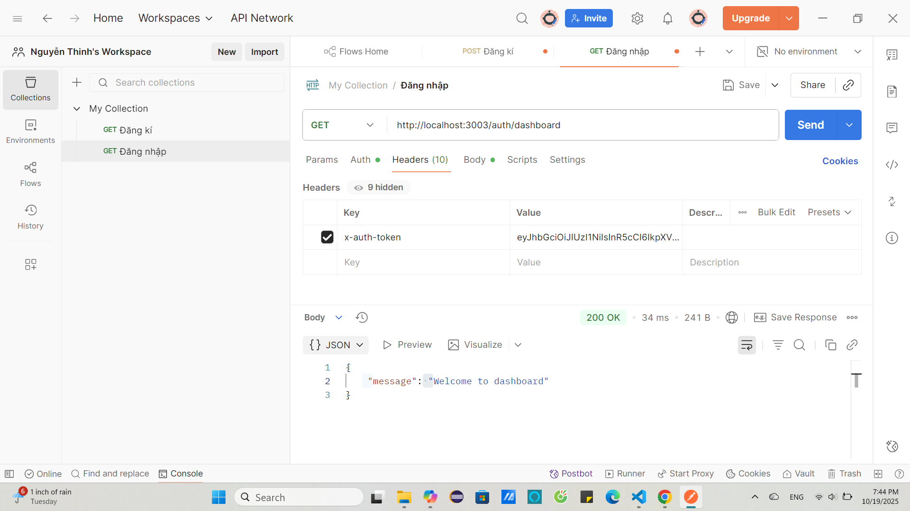
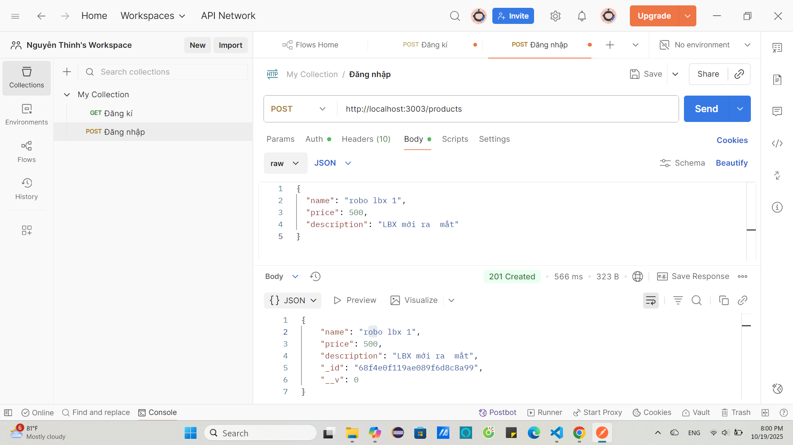
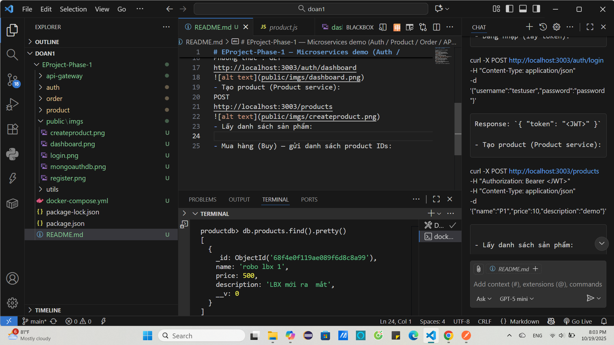
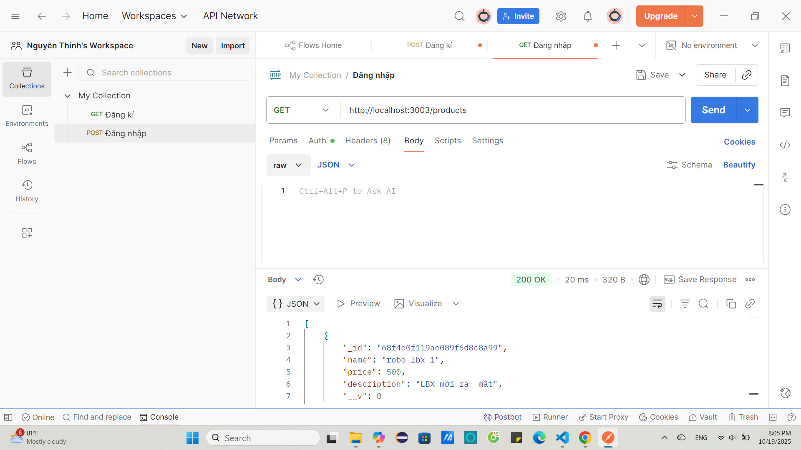
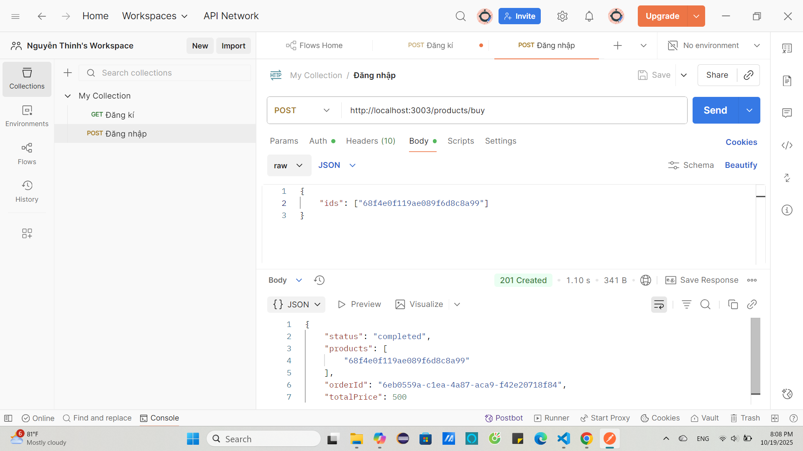
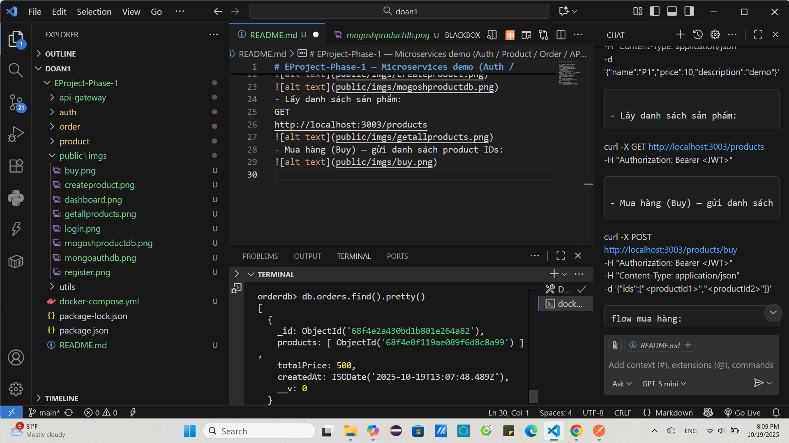

## Microservice
Đây là một đồ án mô phỏng hệ thống thương mại điện tử được xây dựng theo kiến trúc Microservice, sử dụng các công nghệ hiện đại như Node.js, MongoDB, RabbitMQ và Docker. Mỗi chức năng chính của hệ thống được tách thành một dịch vụ riêng biệt, giúp dễ dàng mở rộng, bảo trì và triển khai độc lập.
Tuyệt vời Thịnh ơi! Dưới đây là phần mô tả chi tiết cho từng dịch vụ chính trong hệ thống thương mại điện tử microservice của bạn. Phần này có thể dùng trong file `README.md` hoặc tài liệu kỹ thuật để người đọc hiểu rõ kiến trúc và chức năng từng phần.

---

##  Chi tiết các dịch vụ chính

### 1.  Auth Service – Dịch vụ xác thực người dùng
- **Chức năng**:  
  Xử lý đăng ký, đăng nhập, mã hóa mật khẩu bằng `bcrypt`, tạo và xác thực token JWT.
- **Công nghệ**:  
  Node.js, MongoDB, JWT, bcrypt.
- **Luồng hoạt động**:  
  - Người dùng gửi thông tin đăng ký → hệ thống hash mật khẩu và lưu vào MongoDB.  
  - Khi đăng nhập, hệ thống kiểm tra username/password và trả về token JWT.  
  - Token được dùng để xác thực ở các service khác thông qua API Gateway.

---

### 2.  Product Service – Dịch vụ quản lý sản phẩm
- **Chức năng**:  
  Quản lý danh sách sản phẩm, thêm mới sản phẩm, xử lý logic khi người dùng mua hàng.
- **Công nghệ**:  
  Node.js, MongoDB, RabbitMQ.
- **Luồng hoạt động**:  
  - Người dùng gửi yêu cầu mua sản phẩm qua API Gateway.  
  - Service truy vấn MongoDB để lấy thông tin sản phẩm theo `ids`.  
  - Tạo đơn hàng tạm thời và gửi thông tin qua RabbitMQ đến Order Service.  
  - Lắng nghe phản hồi từ hàng đợi để cập nhật trạng thái đơn hàng.

---

### 3.  Order Service – Dịch vụ xử lý đơn hàng
- **Chức năng**:  
  Nhận thông tin đơn hàng từ RabbitMQ, xử lý trạng thái, tính tổng tiền, và phản hồi lại cho Product Service.
- **Công nghệ**:  
  Node.js, MongoDB, RabbitMQ.
- **Luồng hoạt động**:  
  - Nhận message từ hàng đợi `orders`.  
  - Tính `totalPrice` dựa trên danh sách sản phẩm.  
  - Lưu đơn hàng vào MongoDB.  
  - Gửi phản hồi qua hàng đợi `products` để Product Service cập nhật trạng thái đơn hàng.

---

### 4.  API Gateway – Cổng điều phối dịch vụ
- **Chức năng**:  
  Là điểm truy cập duy nhất cho client. Định tuyến request đến các service tương ứng, kiểm tra token và bảo mật.
- **Công nghệ**:  
  Node.js, Express.
- **Luồng hoạt động**:  
  - Nhận request từ client (Postman, frontend...).  
  - Kiểm tra token JWT nếu cần.  
  - Forward request đến service tương ứng (`auth`, `product`, `order`).  
  - Trả về kết quả cho client.

---

### 5.  MongoDB – Cơ sở dữ liệu NoSQL
- **Chức năng**:  
  Lưu trữ dữ liệu cho các service: người dùng, sản phẩm, đơn hàng.
- **Cấu hình**:  
  Chạy trong container Docker, có thể gắn volume để lưu dữ liệu lâu dài.

---

### 6.  RabbitMQ – Hệ thống hàng đợi thông điệp
- **Chức năng**:  
  Giao tiếp bất đồng bộ giữa các service.  
  Đảm bảo các service không bị phụ thuộc trực tiếp vào nhau.
- **Luồng hoạt động**:  
  - Product Service gửi message đến hàng đợi `orders`.  
  - Order Service nhận message, xử lý và gửi phản hồi về hàng đợi `products`.  
  - Product Service lắng nghe và cập nhật trạng thái đơn hàng.
$$POSTMAN

API — (dùng API Gateway trên cổng 3003)
- Đăng ký:
Phương thức :POST
http://localhost:3003/auth/register

- Đăng nhập (lấy token):
Phương thức :POST
 http://localhost:3003/auth/login

Response: `{ "token": "<JWT>" }` — dùng token ở các 
request sau: `Authorization: Bearer <JWT>`
Phương thức : GET
http://localhost:3003/auth/dashboard

- Tạo product (Product service):
POST
http://localhost:3003/products

- Lấy danh sách sản phẩm:
GET
http://localhost:3003/products

- Mua hàng (Buy) — gửi danh sách product IDs:

Dữ liệu order được lưu vào mongo
